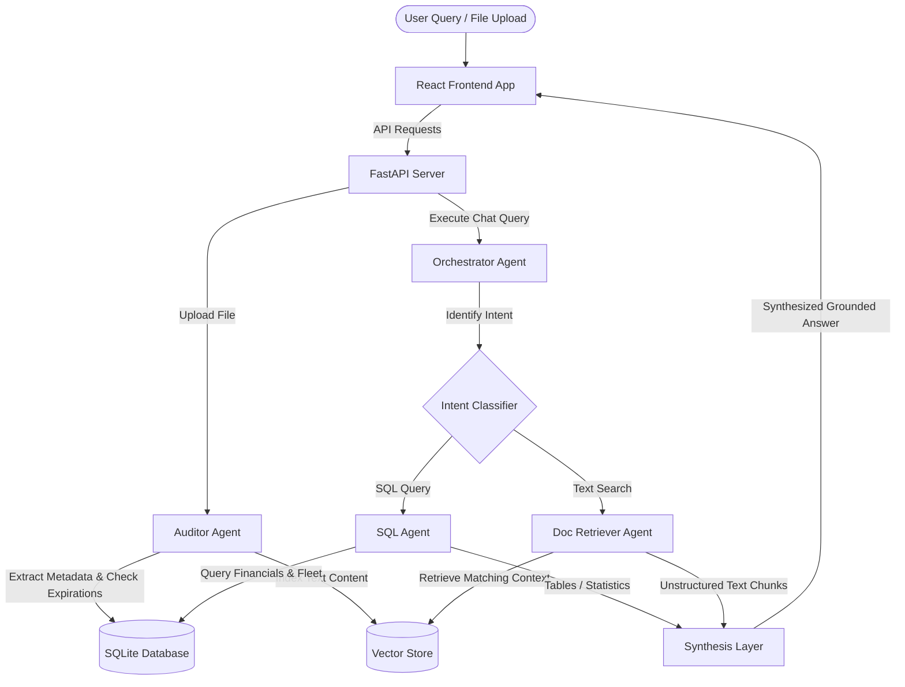

# FleetDoc AI - Agentic Fleet Analytics & Compliance Platform

FleetDoc AI is a production-ready, multi-agent logistics operations center. It uses Large Language Model (LLM) orchestration, Text-to-SQL databases, and OCR document retrieval (RAG) to automate carrier compliance auditing, duplicate identification, and deep fleet financial analytics.

---

## 🚀 Key Features

* **Multi-Agent Orchestration**: A smart routing pipeline ([OrchestratorAgent](backend/agents.py)) that classifies natural language queries into SQL database queries, unstructured text retrieval, or hybrid operations.
* **Autonomous Database Querying**: The [SQLAgent](backend/agents.py) translates natural language into SQLite queries to aggregate fleet finances, automatically correcting syntax errors on execution failure.
* **Compliance Auditor Ingestion**: The [AuditorAgent](backend/agents.py) extracts key entities (dates, amounts, drivers, trailer associations) from uploaded files, alerts operators of expiring registrations, and filters duplicate records.
* **Local Document Vector Store**: Uses a local vector space to index and retrieve scanned invoices, receipts, and tax forms without sending full files to external databases.
* **Premium Sci-Fi Operations UI**: A futuristic theme complete with high-tech CRT terminal traces, dynamic glassmorphic card elements, interactive CSS bar charts, and a responsive navigation pane.

---

## 🛠️ Technology Stack

* **Frontend**: React, Vite, Lucide React (Icons), Vanilla CSS (Custom Design System).
* **Backend**: FastAPI (Python), Uvicorn (ASGI server), SQLite3 (Database).
* **AI Engine Helpers**: Google Generative AI (Gemini), OpenAI API, Claude API integration.

---

## 📁 Repository Structure

```text
fleetdoc-analytics/
├── backend/                       # Python FastAPI Backend
│   ├── agents.py                  # Orchestrator, SQL, RAG, and Auditor Agent definitions
│   ├── db_manager.py              # SQLite Schema initialization and connection management
│   ├── document_processor.py      # TF-IDF Vector indexing and heuristic entity linkers
│   ├── fleet.db                   # Local SQLite Database file
│   ├── main.py                    # API Entrypoints & CORS middlewares
│   ├── requirements.txt           # Python backend dependencies
│   └── test_api.py                # Local API verification scripts
├── frontend/                      # React Frontend Web App
│   ├── src/
│   │   ├── App.jsx                # Main application component & workspace layout
│   │   ├── index.css              # Custom visual styles, hover gradients, and animations
│   │   └── main.jsx               # React DOM entrypoint
│   ├── index.html                 # HTML index wrapper
│   ├── package.json               # Node.js configurations
│   └── vite.config.js             # Vite development server settings
└── sample_documents/              # Messy document simulators for pipeline testing
```

---

## ⚙️ System Architecture



---

## ⚡ Setup & Installation

### Prerequisites
* **Python**: 3.10+ (Recommended: 3.13)
* **Node.js**: 18+

### 1. Backend Setup
1. Open your terminal and navigate to the backend directory:
   ```bash
   cd backend
   ```
2. Install the required Python packages:
   ```bash
   pip install -r requirements.txt
   ```
3. Run the FastAPI development server:
   ```bash
   python main.py
   ```
   The backend will initialize `fleet.db` automatically and run on `http://localhost:8000`.

### 2. Frontend Setup
1. Open a new terminal tab and navigate to the frontend directory:
   ```bash
   cd ../frontend
   ```
2. Install the Node.js packages:
   ```bash
   npm install
   ```
3. Run the Vite development server:
   ```bash
   npm run dev
   ```
   The web application will launch at `http://localhost:5173/`.

---

## 🔑 AI LLM Configuration

The application is pre-configured to default to **OpenAI** as its primary LLM provider.

* **API Key Panel**: To view or change configuration keys, click the **Settings (gear) icon** in the top-right corner of the web header.
* **Auto-detection**: The agents are designed to automatically override the provider query to `openai` if they detect an OpenAI-formatted key (`sk-` or `sk-proj-`), preventing validation crashes.

---

## 💡 Database Schema Reference

The [SQLAgent](backend/agents.py) queries the following local tables to answer analytical questions:

* **`trucks`**: `truck_id` (PK), `make`, `model`, `year`, `license_plate`, `status`
* **`drivers`**: `driver_id` (PK), `name`, `license_number`, `status`
* **`documents`**: `document_id` (PK), `file_name`, `document_type`, `upload_date`, `truck_id`, `driver_id`, `trailer_id`, `vendor`, `amount`, `date`, `expiry_date`, `raw_text`, `is_duplicate`
* **`financial_records`**: `record_id` (PK), `document_id`, `truck_id`, `driver_id`, `record_type` (`Revenue`, `Maintenance`, `Fuel`), `date`, `amount`, `details`
